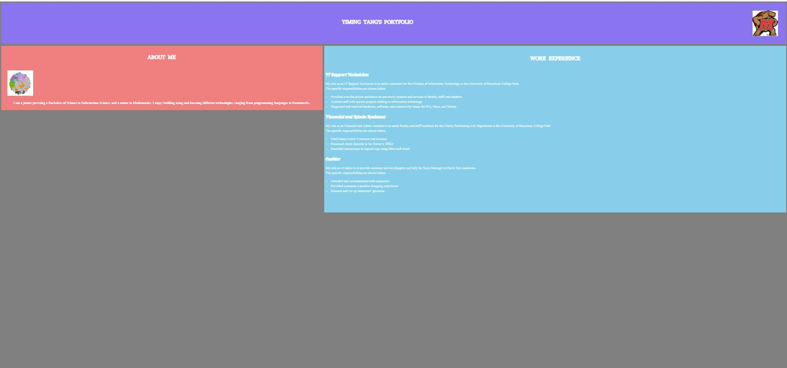

# Simple Portfolio

# About

This is a simple portfolio designed for me to practice my HTML and CSS skills
                         
# Documentation

HTML was used for the backbone of the simple portfolio

CSS was used for the overall aesthetic of the simple portfolio
                        
# Result when the user opens the simple portfolio 

# Result when the user zooms in 

# Result when the user zooms out

